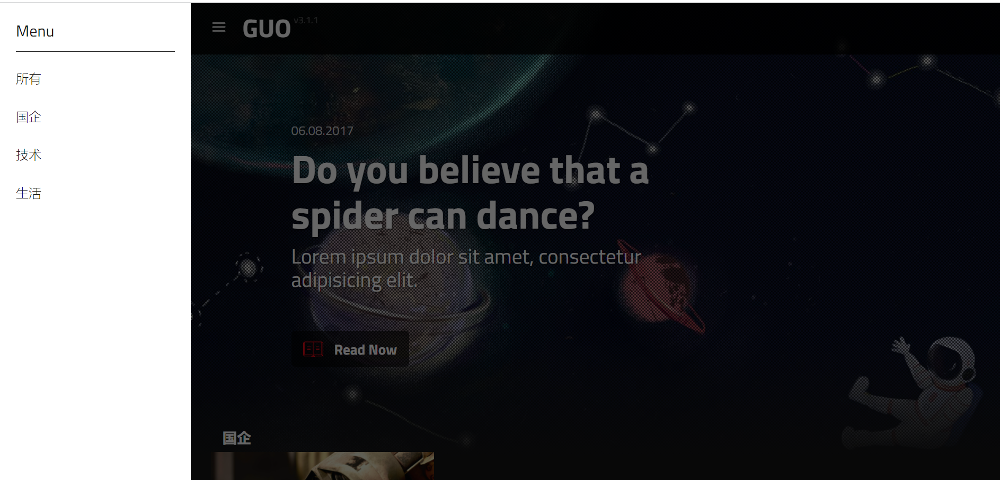

#  仿netflix的Jekyll主题风格，国内版本

## 项目介绍

本项目参考[jekflix-template](https://github.com/thiagorossener/jekflix-template)和[blogdemo](https://github.com/leach-chen/blogdemo),打造基于国内社交媒体的blog网页。

[网站效果预览（点击预览）](https://liujing1995.github.io/)

主页示意图：


菜单示意图：



## Features

- [Google Fonts](https://fonts.google.com/)

- [Live Search](https://github.com/thiagorossener/jekflix-template/wiki/Features#live-search)

- [Estimated Reading Time](https://github.com/thiagorossener/jekflix-template/wiki/Features#estimated-reading-time)

- [Reading Progress Bar](https://github.com/thiagorossener/jekflix-template/wiki/Features#reading-progress-bar) *(optional)*

- ["New Post" tag](https://github.com/thiagorossener/jekflix-template/wiki/Features#new-post-tag)

- [Load images on demand](https://github.com/thiagorossener/jekflix-template/wiki/Features#load-images-on-demand)

- [Push Menu](https://github.com/thiagorossener/jekflix-template/wiki/Features#push-menu)

- [SVG icons](https://github.com/thiagorossener/jekflix-template/wiki/Features#svg-icons)

- [Shell script to create posts](https://github.com/thiagorossener/jekflix-template/wiki/Features#shell-script-to-create-posts)

- [Tags page](https://github.com/thiagorossener/jekflix-template/wiki/Features#tags-page)

- [About page](https://github.com/thiagorossener/jekflix-template/wiki/Features#about-page)

- [busuanzi](http://busuanzi.ibruce.info/)

  

## how to install

1、首先安装 [Ruby](https://www.ruby-lang.org/en/documentation/installation/)和 [NodeJS](https://nodejs.org/) .

2、安装Jekyll.

```
$ gem install jekyll
```

3、其次安装gulp client.

```
$ npm install gulp-cli -g
```

4、Fork 或者直接下载 [Jekyll theme](https://github.com/liujing1995/liujing1995.github.io)仓库代码 

5、cd到项目的路径下

```
$ cd path/to/jekyll-blog-demo
```

6、安装npm packages:

```
$ npm install
```

7、安装 Ruby dependencies:

```
$ bundle install
```

8、Build Jekyll:

```
$ bundle exec jekyll build
```

9、Then run Gulp:

```
$ gulp
```


只需要执行gulp，就可以启动。